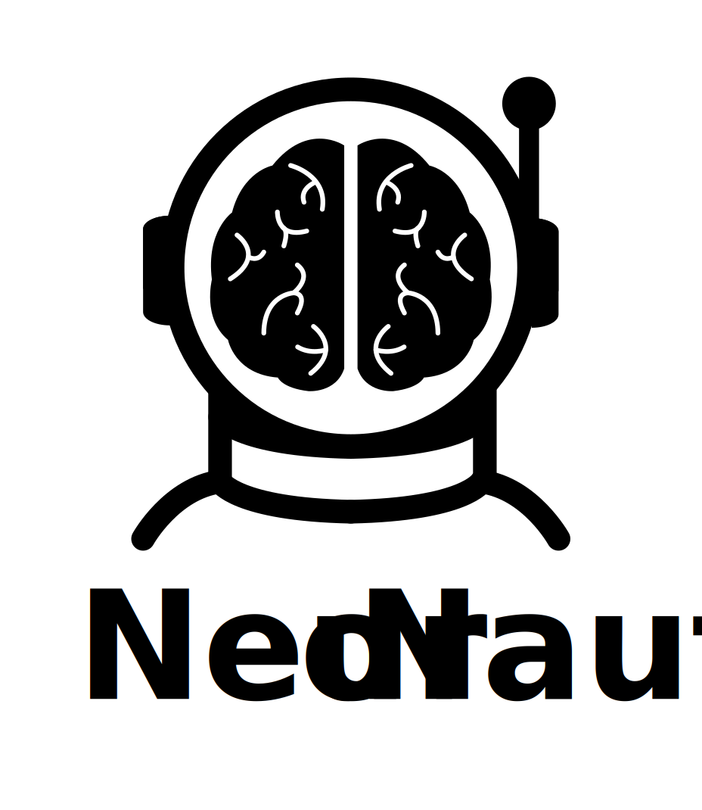

<p align="center"></p>

<h1 align="center">EEG Project WS25/26: Using Prediction Error Negativity to Evaluate the Immersive Experience of VR Environments</h1> 
<p align="center" style="font-size:16px">
    <strong>Jan Hagnberger</strong> and
    <strong>Jianyang Gu</strong></a>
</p>

## Project Overview
This repository contains the code and documentation for the EEG Project in WS25/26 at the University of Stuttgart about "Using Prediction Error Negativity to Evaluate the Immersive Experience of VR Environments". The project involves preprocessing and analyzing EEG data collected during a motion study to investigate prediction error signals in the brain to evaluate the immersive experience of VR environments. The dataset used is publicly available on [OpenNeuro (Dataset ds003846)](https://openneuro.org/datasets/ds003846/versions/1.0.1) and was released and analyzed in the paper [Detecting Visuo-Haptic Mismatches in Virtual Reality using the Prediction Error Negativity of Event-Related Brain Potentials](https://dl.acm.org/doi/10.1145/3290605.3300657) by Gehrke et al., 2019.


## Data Description
The data originates from a study that involved 19 participants performing a reach-to-object task in a virtual reality (VR) environment. Participants experienced three types of feedback: visual, visual with vibrotactile, and visual with vibrotactile combined with electrical muscle stimulation (EMS) feedback (the latter applied to 10 subjects). In 25 % of the trials, the feedback was intentionally provided prematurely, creating prediction error or mismatch ERPs in an oddball-style paradigm. Additionally, participants evaluated their interactive experience using the Immersion and Presence Questionnaire (IPQ) and assessed their workload using the NASA-TLX. The dataset is publicly available on OpenNeuro (Dataset ds003846).

## Download Data on macOS
1. Install git and git-annex (e.g., `brew install git-annex` on macOS)
2. Clone repository with `git clone https://github.com/OpenNeuroDatasets/ds003846.git`
3. Download data files with `git annex get .`

If you are using a different operating system, please refer to the [git-annex documentation](https://git-annex.branchable.com/install) for installation instructions.


## Setup the Python Environment
Install the required Python packages using Conda:
```bash
conda create -n eeg --file requirements.txt
```

## Pipeline Execution
This is currently work in progress. We have two implementations for a pipeline (see Milestone 3) which we have to combine into one single pipeline in the future. Also, we have to make it more user-friendly. However, the core functionality is already implemented, which can be found in the Jupyter Notebooks `erp_analysis.ipynb` in the root directory.


## Milestones
Additionally, we provide the implementations of the milestones in the folder `milestones/`. The project is structured into the milestones to guide the development process of the final pipeline.

### Milestone 2
The Jupyter Notebook `milestone2/visualize_eeg.ipynb` contains the code for Milestone 2, which includes loading, basic filtering, and visualization of the EEG data of one subject. 

### Milestone 3
We implemented the basic pipeline for Milestone 3 separately, to gain maximal experience in working with EEG data. Thus, we have two Jupyter Notebook `milestone3/milesonte3.ipynb` and `milestone3/milesonte3_jan.ipynb` that contain the code for Milestone 3, which includes loading, filtering, resampling, ICA, epoching, and visualization of the ERP of one subject.

Changes from Milestone 2 to Milestone 3:
1. ASR algorithm for EEG denoising
2. ICA algorithm to separate independent components and remove eye movement artifacts
3. Additional filtering during data epoching
4. ERP visualization
5. Encapsulation into functions for single subject and single session processing

Issues:
1. ASR computation is too slow; skipped in actual execution
2. Temporal cleaning relies only on automatic bad epoch detection during epoching; no manual removal of bad events
3. No manual inspection of bad channels


## Homework Tasks
Furthermore, we added the implementations of the homework tasks in the directory `homeworks/`. However, not all homework tasks were completed.
